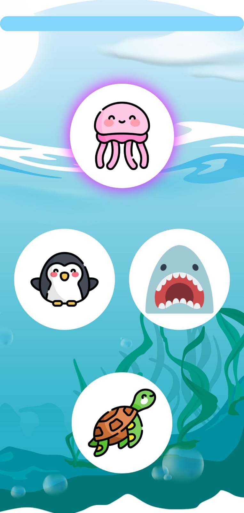
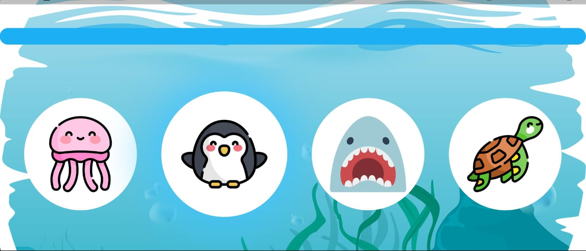
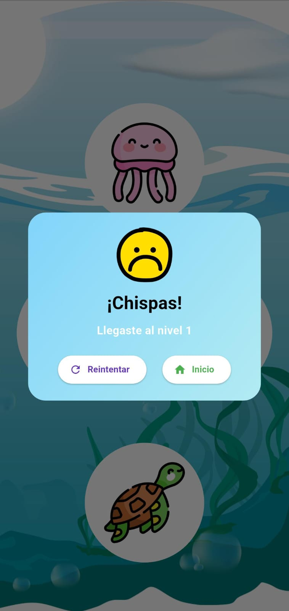

# 🧠 Memory Game – Flutter

Memory Game es un juego interactivo donde el jugador debe **memorizar y repetir secuencias de botones con animales**.  
Cada nivel aumenta la dificultad y el jugador recibe **retroalimentación inmediata con sonidos, animaciones y diálogos emergentes**.

---

## 🎮 Screenshots / GIFs

### 1. Pantalla de inicio
  
*Botón “Play” con diseño animado, fondo colorido y acceso al juego.*

### 2. Pantalla de juego – Vertical
  
*Secuencia de animales en orientación vertical, barra de tiempo pastel y animaciones al presionar cada botón.*

### 3. Pantalla de juego – Horizontal
  
*Secuencia de animales en orientación horizontal, diseño responsivo.*

### 4. Pop-up de intento fallido
  
*Diálogo emergente que aparece cuando el jugador falla la secuencia.*

---

## ⚡ Características principales

- 🐢 Secuencias de animales aleatorias y progresivas por nivel  
- 🔊 Retroalimentación inmediata con sonidos `.mpeg`  
- 🎨 Fondos degradados y diseño responsive  
- ⚙️ Arquitectura modular para escalar fácilmente nuevos niveles, animales o efectos  

---

## 🛠️ Tecnologías y Widgets usados

- **Flutter / Dart** – desarrollo cross-platform  
- **Widgets clave**: `Scaffold`, `Column`, `Row`, `ClipRRect`, `LinearProgressIndicator`, `ElevatedButton`, `Dialog`  
- **Controladores**: `GameController` para lógica de secuencias y niveles  
- **Servicios**: `SoundService` para reproducir sonidos de botones  
- **Assets**: imágenes de animales, fondos y sonidos `.mpeg`  
- **Responsive**: `OrientationBuilder` para soportar portrait y landscape  

---

